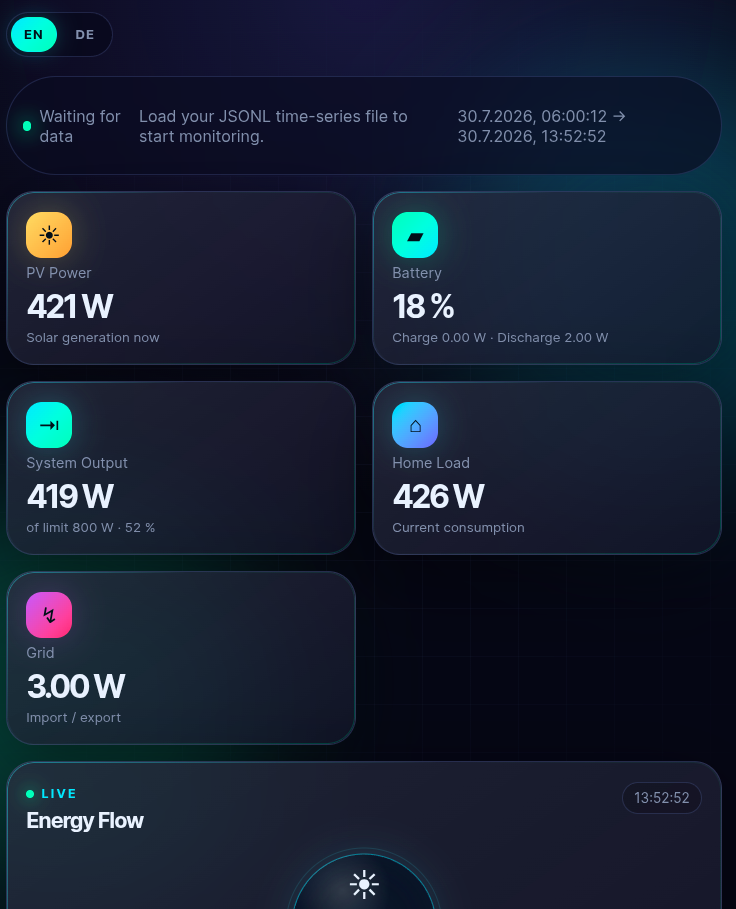
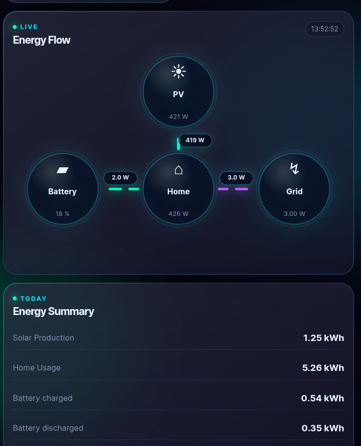
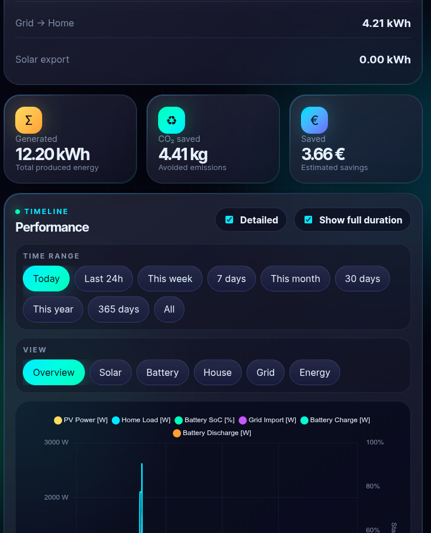
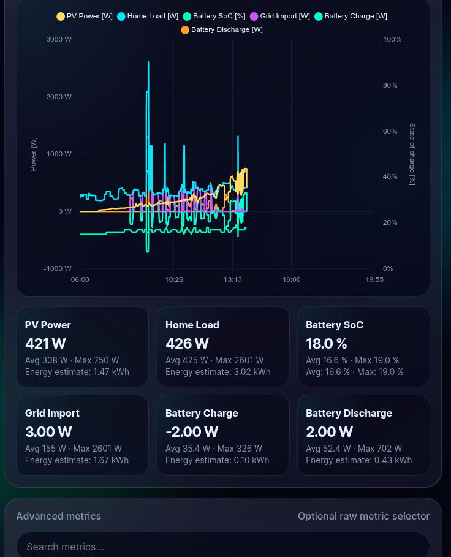

# solix_web_dashboard

A lightweight web dashboard for monitoring Anker Solix solar/battery systems.

This project uses the unofficial [Anker Solix API](https://github.com/thomluther/anker-solix-api), stores monitor data as monthly JSONL time-series files, and serves a browser-based dashboard.

The dashboard displays live PV power, house load, system output, battery state, grid values, and optional energy statistics.

## Features

- Live monitoring of Anker Solix systems
- Browser-based dashboard
- Monthly JSONL time-series storage
- Built-in static webserver
- Optional daily energy statistics
- Lightweight dashboard mode
- Docker deployment support
- Git submodule support

## Project structure

```text
solix_web_dashboard/
├── config/
├── Docker/
├── src/
    ├── api
    ├── dashboard
    ├── solix_api
├── solix_api/
├── .gitmodules
└── README.md
```

## Quick Start

```bash
git clone --recurse-submodules https://github.com/bnnt29/solix_web_dashboard
cd solix_web_dashboard

mkdir -p config

python3 -m venv .venv
source .venv/bin/activate

pip install -r requirements.txt

python src/api/pv_monitor.py \
  --live-cloud \
  --energy-stats \
  --dashboard-light \
  --interval 10 \
  --sample-interval 5 \
  --full-refresh-interval 10800 \
  --storage-root src/dashboard/exports/timeseries \
  --web-folder src/dashboard \
  --web-host 0.0.0.0 \
  --web-port 8080 \
  --config config/solix-monitor.config.json
```

Open http://localhost:8080

## Command-Line Arguments

The following arguments configure the behavior of the monitor, data collection, storage, and web dashboard.

| Argument | Description |
|----------|-------------|
| `--live-cloud` | Uses live data from the Anker cloud. |
| `--energy-stats` | Enables daily energy and statistics requests. |
| `--dashboard-light` | Frequently refreshes live site data, but runs expensive detail requests only periodically. |
| `--interval 10` | Sets the live refresh interval in seconds. |
| `--sample-interval 5` | Sets the JSONL storage check interval in seconds. |
| `--full-refresh-interval 10800` | Sets the full detail refresh interval in seconds. |
| `--storage-root` | Defines the folder used for JSONL time-series exports. |
| `--web-folder` | Defines the folder served by the built-in web server. |
| `--web-host` | Sets the web server bind address. |
| `--web-port` | Sets the web server port. |
| `--config` | Specifies the path to the configuration JSON file. |
| `--console-detail` | Controls the amount of detail shown in console output. |
| `--console-log-level` | Sets the console logging level. |

## Configuration

Example:

```json
{
  "credentials": {
    "user": "",
    "password": "",
    "country": "DE"
  },
  "console": {
    "enabled": true,
    "detail": "compact",
    "log_level": "INFO",
    "show_api_calls": false
  },
  "dashboard": {
    "system_output_cap_w": 800
  }
}
```


## JSONL Time-Series Storage

The monitor writes collected data into monthly **JSONL (JSON Lines)** time-series files.

Default directory structure:

```text
src/dashboard/exports/timeseries/<year>/<year>-<month>.jsonl
```

Example:

```text
src/dashboard/exports/timeseries/2026/2026-01.jsonl
```

The dashboard automatically reads these files and displays the stored data.

Each line in a JSONL file contains a single JSON object. Records can represent either:

- a complete **snapshot** of the system state
- a **delta update** containing only changed values

### Example JSONL Record

```json
{
  "schema": "anker-solix-energy-delta.v1",
  "timestamp": "2026-01-30T12:00:00+01:00",
  "timestamp_unix": 1769770800.0,
  "source": "cloud",
  "mode": "delta",
  "values": {
    "sites.example.solarbank_info.total_photovoltaic_power": "350",
    "sites.example.solarbank_info.to_home_load": "280",
    "sites.example.site_details.legal_power_limit": 800
  }
}
```

### Record Fields

| Field | Description |
| --- | --- |
| `schema` | Version identifier of the stored data format |
| `timestamp` | ISO 8601 timestamp of the measurement |
| `timestamp_unix` | Unix timestamp representation |
| `source` | Source of the data (for example `cloud`) |
| `mode` | Record type (`snapshot` or `delta`) |
| `values` | Key-value pairs containing the measured data |

### Delta Updates

Delta records contain only values that changed since the previous record. This reduces storage usage while keeping the complete time-series history.

To reconstruct the full system state, apply all records in chronological order, starting from the latest snapshot and applying subsequent delta updates.

This storage format provides efficient long-term data storage while allowing fast dashboard loading and historical analysis.

## Docker

Docker files are located in `Docker/`.

```bash
cd Docker
docker compose up -d --build
```

## Security

Do not commit:

```text
config/solix-monitor.config.json
src/dashboard/exports/
```

## Credits

Uses the unofficial Anker Solix API:

https://github.com/thomluther/anker-solix-api

## Disclaimer

Not affiliated with Anker. The API is unofficial and may change at any time. Use at your own risk.

## Example




